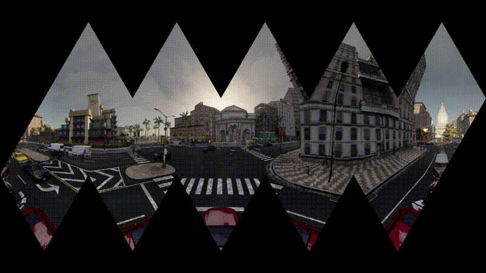

# Unwrapped Icosahedral Maps 
My humble attempt to create unwrapped icosahedral maps from equirectangular images.
Insipration taken from [here](http://www.paulbourke.net/panorama/icosahedral/).


## Installation
This code was developed using ```python 3.8```, however it should run on anything that has  >= ```python 3.6```.

To install the requirements, one can simply run:

```bash
$ pip install -r requiremets.py
```

## Usage
The base class that one can use is the ```IcosahedralSampler``` class.
Sample usage:
```python
from ico_sampler import IcosahedralSampler

eq_image = imread('./assets/0.png')
ico_sampler = IcosahedralSampler(resolution = 600)

# generate unwrapped maps (as presented above)
unwrapped_image = ico_sampler.unwrap(eq_image, face_offset=0)

# generate unwrapped maps and shift they faces are put into the final panorama
unwrapped_image = ico_sampler.unwrap(eq_image, face_offset=2)


# create the image of the triangular face
face_image = ico_sampler.get_face_image(face_no=0, eq_image=eq_image)

# sample face colors from an eq image
face_colors = ico_sampler.get_face_rgb(face_no=0, eq_image=eq_image)

```
One can run the provided [sample notebook](./examples.ipynb) to see exactly how the code works.
One can create shift the output image by specifying the _face_offset_ when calling ```ico_sampler.unwrap()```:




## Command line
This repository also contains a command line utility program that can convert an equirectangular image 
to an incosahedral projection map:

```bash
$ python unwrap.py --input=<path to input> \ 
                   --output=<path to output> \
                   --face_resolution=600 \ 
                   --face_offset=0
```

## TODOs
A list of TODOs that might be implemented in the future:
- [ ] add interpolation when sampling the colors (current method: nearest) - this can cause grainy images, but 
increasing the face resolution (>600px) should diminish this effect 
- [ ] add a tutorial like notebook to go over spherical projections

## References
During the creation of this repository I hhave found the following articles to be useful:

- [http://www.paulbourke.net/panorama/icosahedral/](http://www.paulbourke.net/panorama/icosahedral/)
- [https://www.songho.ca/opengl/gl_sphere.html](https://www.songho.ca/opengl/gl_sphere.html)
- [https://en.wikipedia.org/wiki/Regular_icosahedron](https://en.wikipedia.org/wiki/Regular_icosahedron)
- [https://mathworld.wolfram.com/RegularIcosahedron.html](https://mathworld.wolfram.com/RegularIcosahedron.html)
